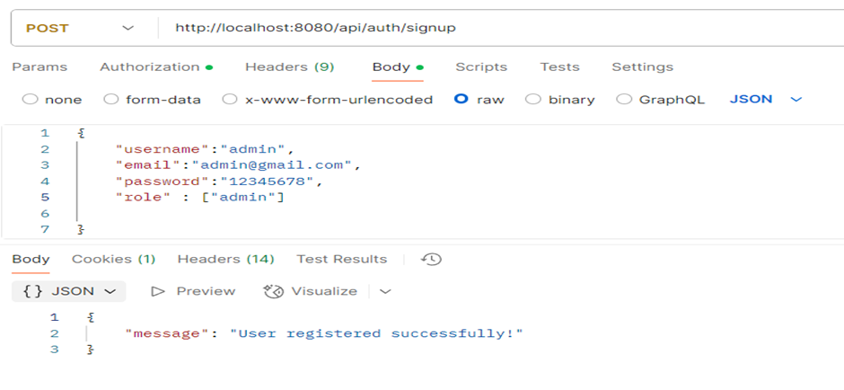
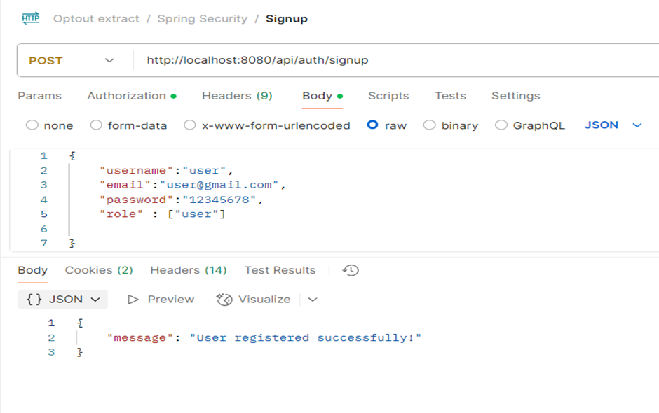
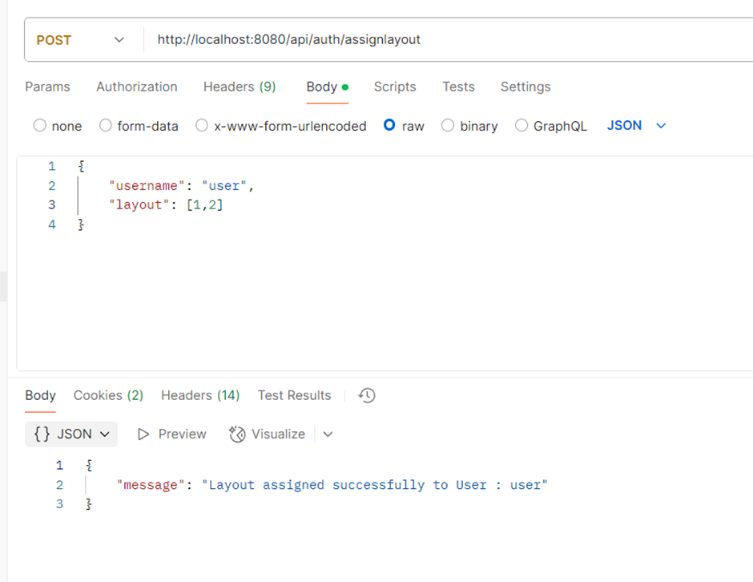
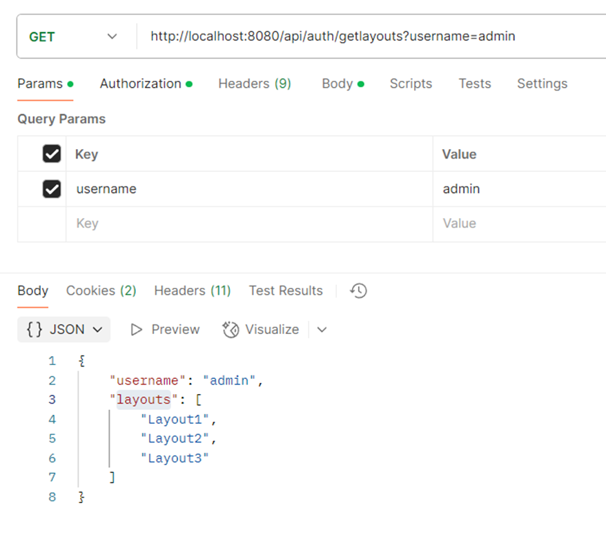
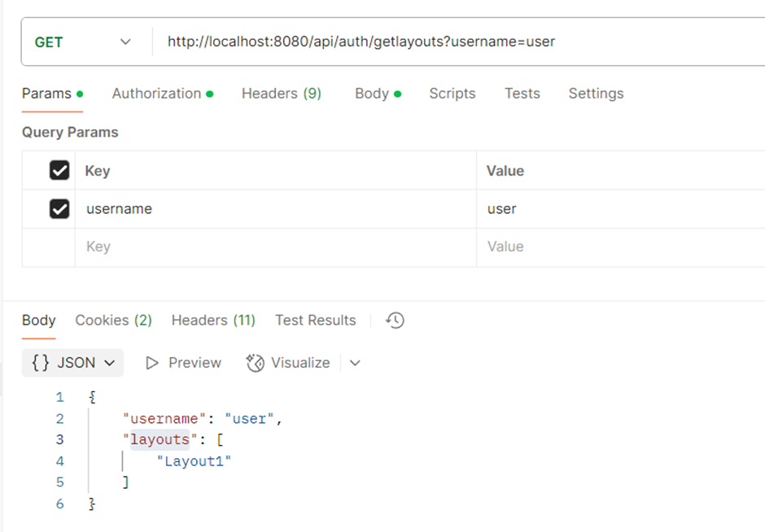

# Java Spring Boot Microservice for User Layout Assignment

- Explanation:

When admin logins in there will be a list of layouts, admin can assign layouts to users or user groups.
When a user logs in, whatever the layout has been assigned him or his group will be the default layout and all the pages in the application will be displaying that layout.

- Requirement :

1. Create schema and java spring boot microservice.
2. Create one GET api to display list of available layouts for the admin
3. Create POST api to assign selected layout to the user/user groups
4. Create UPDATE api to change the layout
5. Create GET api to fetch the layout details when user login.

## Assignment.

This Java Spring Boot microservice project using PostgreSQL for managing and assigning layouts to users. The project involves creating tables for roles, layouts, users, user roles, and user layouts. The tables are automatically generated with the following Hibernate configuration in application.properties:
- Hibernate DDL auto (create, create-drop, validate, update)

  spring.jpa.hibernate.ddl-auto=update

## Configure Spring Datasource, JPA, App properties
Open `src/main/resources/application.properties`
- For PostgreSQL:
```
spring.datasource.url=jdbc:postgresql://localhost:5432/testdb
spring.datasource.username=postgres
spring.datasource.password=123

spring.jpa.properties.hibernate.jdbc.lob.non_contextual_creation=true
spring.jpa.properties.hibernate.dialect=org.hibernate.dialect.PostgreSQLDialect

# Hibernate ddl auto (create, create-drop, validate, update)
spring.jpa.hibernate.ddl-auto=update
```

## Run Spring Boot application
```
mvn spring-boot:run
```

## Run following SQL insert statements
```
--3 default Roles
INSERT INTO roles(name) VALUES('ROLE_USER');
INSERT INTO roles(name) VALUES('ROLE_MODERATOR');
INSERT INTO roles(name) VALUES('ROLE_ADMIN');

--You can add the layouts if you want
INSERT INTO TeraLayout (name, description) VALUES
('Layout1', 'Description for Layout1'),
('Layout2', 'Description for Layout2'),
('Layout3', 'Description for Layout3');
```

## Steps to Execute and Test Functionalities

- Sign Up Admin and Users:

To register an admin user with the role of "admin", use the following endpoint:
Endpoint:
POST  : http://localhost:8080/api/auth/signup
        
Request Body:

{
"username": "admin",
"email": "admin@gmail.com",		
"password": "12345678",		
"role": ["admin"]       
}



User sign Up



Upon signing in as an admin, retrieve the list of layouts available to the admin. This functionality ensures that admin users can view all available layouts.
Note: Regular users will not have any layouts assigned initially.

## Create a POST API to Assign Layouts: This will fullfill 3rd point in requirement.

Assign a specific layout to a user or user group using the following endpoint:

Endpoint:

POST http://localhost:8080/api/auth/assignlayout

Request Body:
{
"username": "user",
"layout": [1]
}



This allows you to assign a layout from the layout table to a user by providing the relevant layout ID.

## Use Get end point to get the layouts assigned : This will fullfill 6th and 5th point of requirement

EndPoint:

GET http://localhost:8080/api/auth/getlayouts?username=?

This get Retrieve the list of layouts available to the admin or user. This functionality ensures that admin users can view all available layouts and returns assigned layoyts for user.

Admin has all the available layouts 


User have the layouts assigned to it.


## Create an UPDATE API to Modify exsisting Layouts: This will fullfill 4th point of requirement

Update the layouts assigned to a user by utilizing the same endpoint used for assigning layouts:

Endpoint:

POST http://localhost:8080/api/auth/assignlayout

Modify the layout assignments by adjusting the layout IDs in the request body as needed.


# Additional Considerations

### Adding UI around the application
- Use Angular to build a UI around the application to assign layouts.
### Error Handling:
- Implement proper error handling and validation in your controllers and services.
### Logging and Monitoring:
- Add logging to track application flow and potential issues.
### Documentation:
- Document your API using Swagger or similar tools for easy reference.